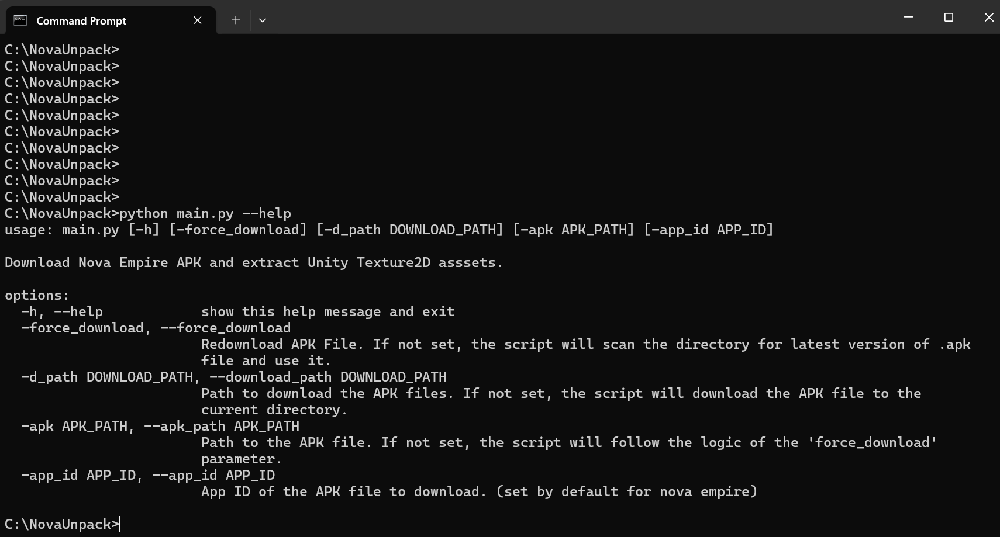

# Nova Empire Asset Unpacking Tool (foolproof hopefully)

Tool which installs the latest Nova Empire game files, unzips it, and extracts all Unity's 2D Textures and Sprites while keeping folder structure intact.

## How to Use (from scratch)

1. Install **[Python](https://www.python.org/downloads/)** on your computer (should work with latest python version >3.0.0)
2. Install **[Git](https://git-scm.com/downloads)** on your computer
3. Open up a command shell and run **`git clone https://github.com/ArtanisTheOne/NovaUnpack`**
4. In command shell enter the cloned directory by doing *`cd NovaUnpack`*
5. From there you need to install the libraries needed, so run **`pip install -r requirements.txt`**
6. Finally you only need to run **`python main.py`** (you can run `python main.py --help` for some parameters that you might want to set)

The script handles downloading the most recent game files. All you need to do is run it.

It's a recursive tool and not configured to run in parallel right now, so it takes a while to extract everything (around 5 minutes on my computer). That 5 minutes is solely the extraction process and doesn't take into account downloading the APK file (~2GB) and unzipping it.

Right now it only exports possible images in a png format, can easily be adjusted to output the 3D objects in the game in a .obj format if wanted. Same goes for audio.

